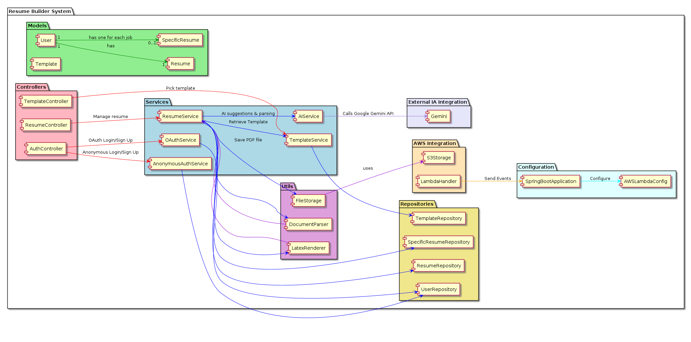

# Resume Builder System - Architecture Documentation

The **Resume Builder System** is a system designed to create and manage resumes efficiently, utilizing an architecture based on Spring Boot and AWS Lambda to optimize costs in scenarios with low initial demand. The structure is organized into packages that clearly separate responsibilities, promoting modularity and scalability.

## Architecture Overview

### Models
At the top of the architecture, the models define the main entities:
- **User**: Represents users, who can be anonymous (with a `trialCode` in the format `dddd-dddd-dddd-dddd` valid for 7 days) or authenticated via OAuth (LinkedIn or Google, without traditional login/password).
- **Resume**: Stores resume information, including raw data (`rawData`), parsed data (`parsedData`), selected template (`templateId`), custom styles (`styles`), generated PDF URL (`pdfUrl`), and metadata such as creation date.
- **Template**: Defines pre-configured LaTeX templates with customizable fields (e.g., color palette, fonts).

### Services
The service layer contains the business logic:
- **AnonymousAuthService**: Generates and validates trial codes for anonymous accounts, ensuring temporary access for 7 days.
- **OAuthService**: Integrates authentication with LinkedIn and Google, eliminating the need for traditional credentials.
- **ResumeService**: Manages the complete resume workflow: upload (PDF, Word, or text), parsing, manual editing, preview generation, and PDF download with temporary storage for 3 days.
- **TemplateService**: Manages LaTeX templates, allowing listing of options, template application, and style customization.

### Controllers
The controllers provide the API entry points:
- **AuthController**: Handles anonymous and OAuth authentication, delegating logic to the corresponding services.
- **ResumeController**: Exposes endpoints for resume operations, such as upload, editing, and PDF generation.

### Repositories
Persistence interfaces for `User`, `Resume`, and `Template`, likely implemented with a serverless database like DynamoDB to align with the AWS Lambda architecture.

### Utils
Support tools:
- **DocumentParser**: Extracts data from uploaded files (PDF, Word, or text).
- **LatexRenderer**: Converts data into PDFs using LaTeX templates.
- **FileStorage**: Abstracts file storage, handling uploads, URL generation, and automatic deletion after 3 days.

### Configuration
System configurations:
- **SpringBootApplication**: Entry point for Spring Boot.
- **AWSLambdaConfig**: Specific configurations for running on AWS Lambda.

### AWS Integration
Integration with AWS services:
- **S3Storage**: Temporarily stores PDFs (3 days) and provides pre-signed URLs, connected to `FileStorage`.
- **LambdaHandler**: Adapter to integrate Spring Boot with AWS Lambda.

### Relationships
- A `User` has one primary `Resume`, used to generate others (1:1).
- A `User` can have multiple `SpecificResume` instances (1:N), one for each specific job opening.
- Each `SpecificResume` is associated with a single `Template` (1:1).
- Services interact with repositories and utilities as needed, while the `ResumeService` orchestrates the main system workflow.

This structure was designed to be lightweight and cost-effective, leveraging AWS Lambda’s automatic scalability and S3’s temporary storage, with a focus on simplicity and functionality.

## Architecture Diagram

