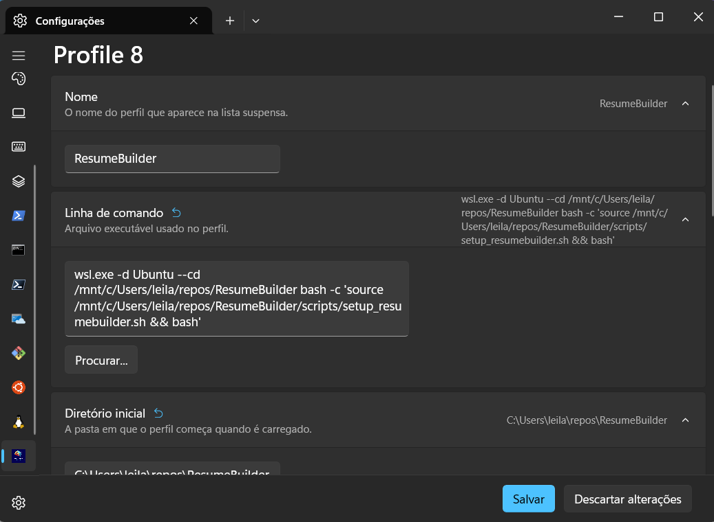
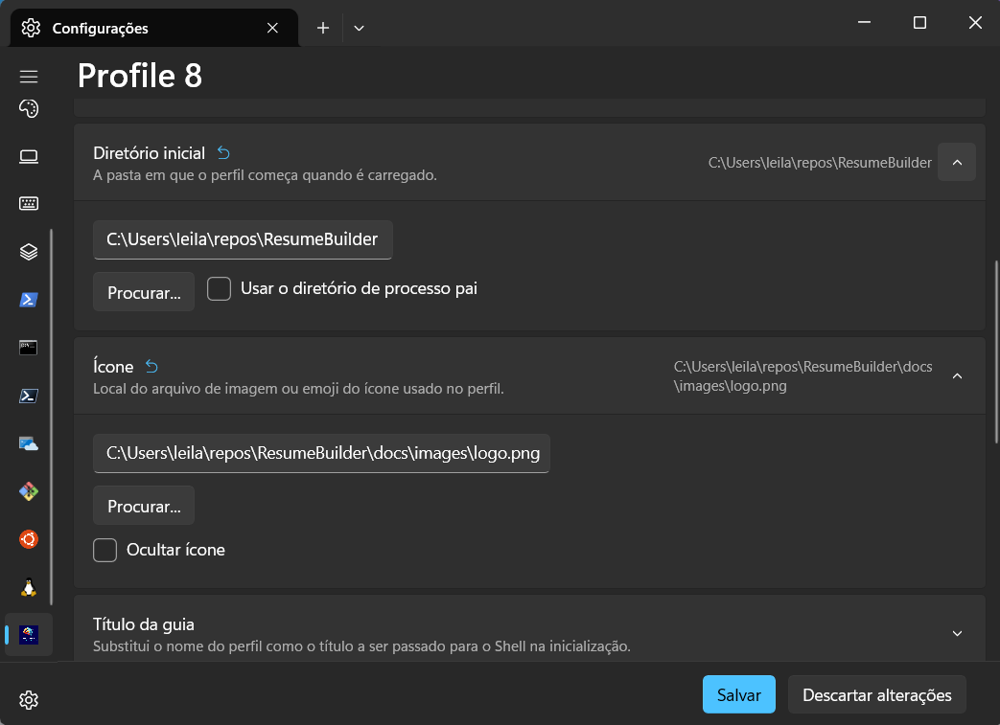

<!----------------------------------------------------------------------- 
	This is part of the documentation of Deployo.io Resume Builder System.
	Copyright (C) 2025
	Leila Otto Algarve
	See LICENSE-DOCUMENTATION for copying conditions. 
------------------------------------------------------------------------>
# Configurations

## Git

### Your Data
`git config --global user.name "<your name>"`  
`git config --global user.email "<your email>"`

### End of Line
If Git changes the end-of-line style, some scripts may not work correctly.  
`git config --global core.eol lf`  
`git config --global core.autocrlf false`

## WSL

You can create a new profile in Windows Terminal for WSL to start in the project's root directory and configure the `PATH` along with other environment variables.

**Steps:**
1. Open the settings: use the menu or press `Ctrl+,`.
2. Click the plus (`+`) sign to add a new profile.
3. Set a name, e.g., `ResumeBuilder`.
4. Set the command line: `wsl.exe -d Ubuntu --cd <root_project_directory>/ResumeBuilder bash -c 'source <root_project_directory>/ResumeBuilder/scripts/setup_resumebuilder.sh && bash'`.
5. Set the starting directory: `<root_project_directory>`.
6. (Optional) Icon: select the logo at `<root_project_directory>/docs/images/logo.png`.
7. (Optional) Appearance: choose a color scheme and font.

The two figures below show my configuration:

  

