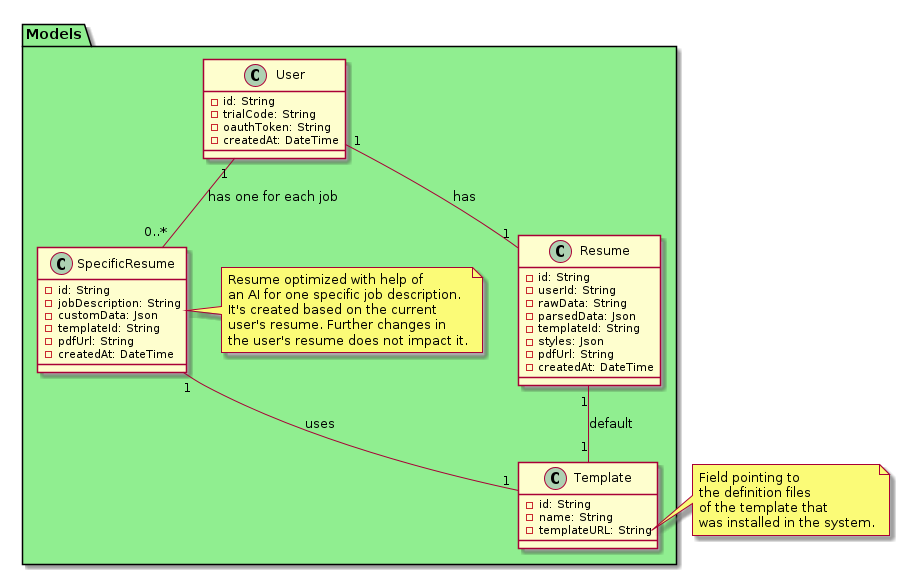
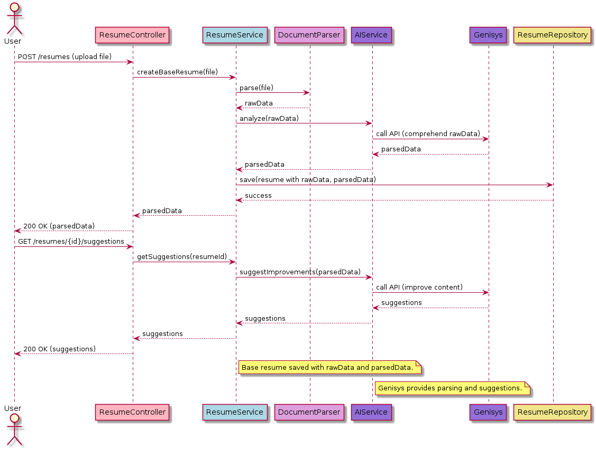
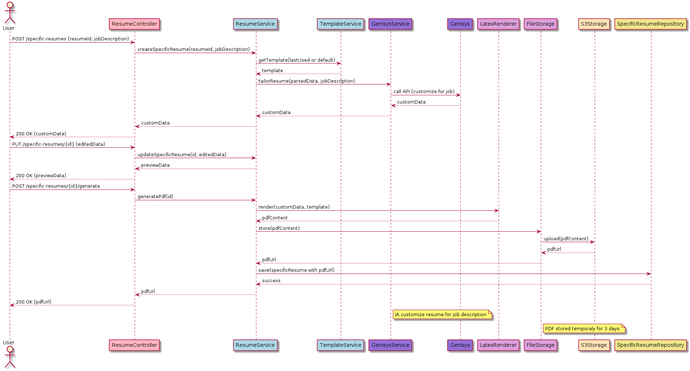

<!----------------------------------------------------------------------- 
	This is part of the documentation of Deployo.io Resume Builder System.
	Copyright (C) 2025
	Leila Otto Algarve
	See LICENSE-DOCUMENTATION for copying conditions. 
------------------------------------------------------------------------>
# How the ResumeService Works in the Resume Builder System

The **ResumeService** is the core component of the **Resume Builder System**, responsible for managing the creation, editing, and generation of resumes, both in the form of a base resume (`Resume`) and customized versions for specific job openings (`SpecificResume`). It coordinates interactions between various layers of the architecture, such as models, auxiliary services, repositories, and utilities, ensuring a seamless user experience. Below, we detail how the service operates in its main use cases.

## Structure and Relationships

The `ResumeService` works with the following key entities, defined in the `Models` package:

- **User**: Represents the user, who can be anonymous (with a `trialCode`) or authenticated via OAuth (`oauthToken`). Each user has a single base resume (`Resume`) and may have multiple specific resumes (`SpecificResume`).
- **Resume**: The user’s base resume, containing raw data (`rawData`), parsed data (`parsedData`), a default template (`templateId`), customized styles (`styles`), a generated PDF URL (`pdfUrl`), and metadata such as `createdAt`.
- **SpecificResume**: An optimized version of the resume tailored to a specific job opening, created based on the user’s `Resume` at the time of generation. It includes the job description (`jobDescription`), customized data (`customData`), an associated template (`templateId`), and the PDF URL (`pdfUrl`). Subsequent changes to the `Resume` do not affect already created `SpecificResume` instances.
- **Template**: Defines the available templates, with an identifier (`id`), name (`name`), and a URL (`templateURL`) pointing to the template definition files installed in the system.

The relationships are:

- A `User` has one `Resume` (1:1).
- A `User` can have zero or more `SpecificResume` instances (1:N), one for each job.
- Both `Resume` and `SpecificResume` use a `Template` (1:1), with the `Resume`’s template being the default.

## Operational Flow

### 1. Creating the Base Resume

When a user uploads a file (PDF, Word, or text) after registering:

1. The `ResumeController` receives the request and delegates it to the `ResumeService`.
2. The `ResumeService` uses the `DocumentParser` to extract raw data (`rawData`) from the file.
3. This data is sent to the `AIService`, which leverages an external AI (e.g., from Google) to analyze and generate structured parsed data (`parsedData`).
4. The `ResumeService` saves the `Resume` in the `ResumeRepository` with `rawData` and `parsedData`.
5. The parsed data is returned to the user via the `ResumeController` for review.
6. The user can request improvement suggestions from the `AIService`, which provides recommendations based on the AI analysis, allowing manual edits before saving changes.

### 2. Generating a Customized Resume for a Job Opening

When the user wants to create a resume tailored to a specific job:

1. The user submits the job description (`jobDescription`) via the `ResumeController`.
2. The `ResumeService` retrieves the last-used template or the default one from the `Resume` through the `TemplateService`.
3. The `AIService` is invoked to customize the `Resume`’s `parsedData` based on the `jobDescription`, generating optimized `customData` for the job.
4. The `customData` is displayed to the user, who can manually edit it.
5. After adjustments, the user requests a preview, generated by the `LatexRenderer` using the chosen template.
6. When satisfied, the user requests PDF generation:
   - The `ResumeService` coordinates with the `LatexRenderer` to create the PDF file from `customData` and the template.
   - The PDF is sent to `FileStorage`, which stores it temporarily in `S3Storage` (valid for 3 days) and returns a `pdfUrl`.
   - The `SpecificResume` is saved in the `SpecificResumeRepository` with the customized data and `pdfUrl`.
7. The `pdfUrl` is returned to the user for download.

## Integrations and Dependencies

The `ResumeService` relies on:

- **AIService**: Provides advanced parsing and improvement suggestions via an external AI, replacing the former `GenisysService`.
- **TemplateService**: Manages available templates, providing the `templateURL` for rendering.
- **DocumentParser**: Extracts raw data from uploaded files.
- **LatexRenderer**: Converts data and templates into PDFs.
- **FileStorage**: Abstracts storage in S3, ensuring temporary URLs.
- **Repositories**: Persist `Resume` and `SpecificResume` data.

## Technical Characteristics

- **Modularity**: The `ResumeService` separates responsibilities, delegating specific tasks to auxiliary services.
- **Scalability**: Integration with AWS Lambda and S3 enables handling usage spikes without high fixed costs.
- **Flexibility**: Supports both anonymous and authenticated users, with independent base and customized resumes.

## Final Considerations

The `ResumeService` is the heart of the system, offering an intuitive flow for creating and customizing resumes. Integration with AI via `AIService` enhances the quality of parsing and suggestions, while LaTeX templates ensure professional PDFs. The lightweight, serverless architecture keeps the system cost-effective and scalable, ideal for scenarios with low initial demand and growth potential.# How the ResumeService Works in the Resume Builder System

The **ResumeService** is the core component of the **Resume Builder System**, responsible for managing the creation, editing, and generation of resumes, both in the form of a base resume (`Resume`) and customized versions for specific job openings (`SpecificResume`). It coordinates interactions between various layers of the architecture, such as models, auxiliary services, repositories, and utilities, ensuring a seamless user experience. Below, we detail how the service operates in its main use cases.

## Structure and Relationships

The `ResumeService` works with the following key entities, defined in the `Models` package:

- **User**: Represents the user, who can be anonymous (with a `trialCode`) or authenticated via OAuth (`oauthToken`). Each user has a single base resume (`Resume`) and may have multiple specific resumes (`SpecificResume`).
- **Resume**: The user’s base resume, containing raw data (`rawData`), parsed data (`parsedData`), a default template (`templateId`), customized styles (`styles`), a generated PDF URL (`pdfUrl`), and metadata such as `createdAt`.
- **SpecificResume**: An optimized version of the resume tailored to a specific job opening, created based on the user’s `Resume` at the time of generation. It includes the job description (`jobDescription`), customized data (`customData`), an associated template (`templateId`), and the PDF URL (`pdfUrl`). Subsequent changes to the `Resume` do not affect already created `SpecificResume` instances.
- **Template**: Defines the available templates, with an identifier (`id`), name (`name`), and a URL (`templateURL`) pointing to the template definition files installed in the system.

The relationships are:

- A `User` has one `Resume` (1:1).
- A `User` can have zero or more `SpecificResume` instances (1:N), one for each job.
- Both `Resume` and `SpecificResume` use a `Template` (1:1), with the `Resume`’s template being the default.

## Operational Flow

### 1. Creating the Base Resume

When a user uploads a file (PDF, Word, or text) after registering:

1. The `ResumeController` receives the request and delegates it to the `ResumeService`.
2. The `ResumeService` uses the `DocumentParser` to extract raw data (`rawData`) from the file.
3. This data is sent to the `AIService`, which leverages an external AI (e.g., from Google) to analyze and generate structured parsed data (`parsedData`).
4. The `ResumeService` saves the `Resume` in the `ResumeRepository` with `rawData` and `parsedData`.
5. The parsed data is returned to the user via the `ResumeController` for review.
6. The user can request improvement suggestions from the `AIService`, which provides recommendations based on the AI analysis, allowing manual edits before saving changes.

### 2. Generating a Customized Resume for a Job Opening

When the user wants to create a resume tailored to a specific job:

1. The user submits the job description (`jobDescription`) via the `ResumeController`.
2. The `ResumeService` retrieves the last-used template or the default one from the `Resume` through the `TemplateService`.
3. The `AIService` is invoked to customize the `Resume`’s `parsedData` based on the `jobDescription`, generating optimized `customData` for the job.
4. The `customData` is displayed to the user, who can manually edit it.
5. After adjustments, the user requests a preview, generated by the `LatexRenderer` using the chosen template.
6. When satisfied, the user requests PDF generation:
   - The `ResumeService` coordinates with the `LatexRenderer` to create the PDF file from `customData` and the template.
   - The PDF is sent to `FileStorage`, which stores it temporarily in `S3Storage` (valid for 3 days) and returns a `pdfUrl`.
   - The `SpecificResume` is saved in the `SpecificResumeRepository` with the customized data and `pdfUrl`.
7. The `pdfUrl` is returned to the user for download.

## Integrations and Dependencies

The `ResumeService` relies on:

- **AIService**: Provides advanced parsing and improvement suggestions via an external AI, replacing the former `GenisysService`.
- **TemplateService**: Manages available templates, providing the `templateURL` for rendering.
- **DocumentParser**: Extracts raw data from uploaded files.
- **LatexRenderer**: Converts data and templates into PDFs.
- **FileStorage**: Abstracts storage in S3, ensuring temporary URLs.
- **Repositories**: Persist `Resume` and `SpecificResume` data.

## Technical Characteristics

- **Modularity**: The `ResumeService` separates responsibilities, delegating specific tasks to auxiliary services.
- **Scalability**: Integration with AWS Lambda and S3 enables handling usage spikes without high fixed costs.
- **Flexibility**: Supports both anonymous and authenticated users, with independent base and customized resumes.

## Final Considerations

The `ResumeService` is the heart of the system, offering an intuitive flow for creating and customizing resumes. Integration with AI via `AIService` enhances the quality of parsing and suggestions, while LaTeX templates ensure professional PDFs. The lightweight, serverless architecture keeps the system cost-effective and scalable, ideal for scenarios with low initial demand and growth potential.
