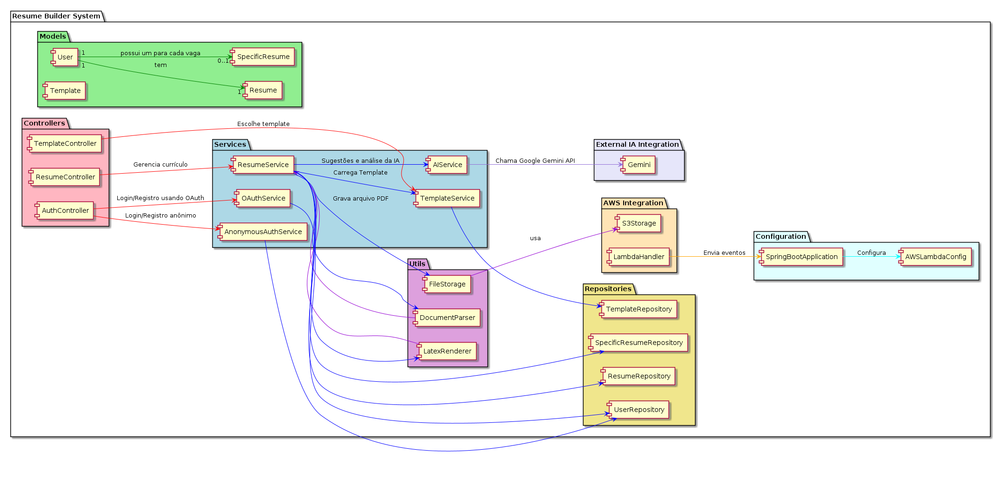

<!----------------------------------------------------------------------- 
	This is part of the documentation of Deployo.io Resume Builder System.
	Copyright (C) 2025
	Leila Otto Algarve
	Licensed under the GNU Free Documentation License v1.3 or later.
    See LICENSE-DOCUMENTATION for details. 
------------------------------------------------------------------------>
# Resume Builder System - Documentação da Arquitetura

O **Resume Builder System** é um sistema projetado para criar e gerenciar currículos de forma eficiente, utilizando uma arquitetura baseada em Spring Boot e AWS Lambda para otimizar custos em cenários de baixa demanda inicial. A estrutura é organizada em pacotes que separam responsabilidades claras, promovendo modularidade e escalabilidade.

## Explicação da Arquitetura

### Models
No topo da arquitetura, os modelos definem as entidades principais:
- **User**: Representa os usuários, que podem ser anônimos (com `trialCode` no formato `dddd-dddd-dddd-dddd` e validade de 7 dias) ou autenticados via OAuth (LinkedIn ou Google, sem login/senha tradicional).
- **Resume**: Armazena informações do currículo, incluindo dados brutos (`rawData`), dados parseados (`parsedData`), modelo escolhido (`templateId`), estilos personalizados (`styles`), URL do PDF gerado (`pdfUrl`) e metadados como data de criação.
- **Template**: Define modelos LaTeX pré-configurados, com campos personalizáveis (ex.: paleta de cores, fontes).

### Services
A camada de serviços contém a lógica de negócio:
- **AnonymousAuthService**: Gera e valida códigos de teste para contas anônimas, garantindo acesso temporário de 7 dias.
- **OAuthService**: Integra autenticação com LinkedIn e Google, eliminando a necessidade de credenciais tradicionais.
- **ResumeService**: Gerencia o fluxo completo do currículo: upload (PDF, Word ou texto), parsing, edição manual, geração de preview e download em PDF com armazenamento temporário de 3 dias.
- **TemplateService**: Administra os modelos LaTeX, permitindo listar opções, aplicar templates e customizar estilos.

### Controllers
Os controladores fornecem os pontos de entrada da API:
- **AuthController**: Lida com autenticação anônima e OAuth, delegando a lógica aos serviços correspondentes.
- **ResumeController**: Expõe endpoints para operações de currículo, como upload, edição e geração de PDFs.

### Repositories
Interfaces de persistência para `User`, `Resume` e `Template`, provavelmente implementadas com um banco serverless como DynamoDB para alinhar com a arquitetura AWS Lambda.

### Utils
Ferramentas de suporte:
- **DocumentParser**: Extrai dados de arquivos enviados (PDF, Word ou texto).
- **LatexRenderer**: Converte dados em PDFs usando templates LaTeX.
- **FileStorage**: Abstrai o armazenamento de arquivos, com upload, geração de URLs e exclusão automática após 3 dias.

### Configuration
Configurações do sistema:
- **SpringBootApplication**: Ponto de entrada do Spring Boot.
- **AWSLambdaConfig**: Configurações específicas para execução no AWS Lambda.

### AWS Integration
Integração com serviços AWS:
- **S3Storage**: Armazena PDFs temporariamente (3 dias) e fornece URLs pré-assinadas, conectado ao `FileStorage`.
- **LambdaHandler**: Adaptador para integrar o Spring Boot com o AWS Lambda.

### Relacionamentos
- Um `User` possui um `Resume` principal, usado para gerar os outros(1:1).
- Um `User` pode ter vários `SpecificResume` (1:N), um para cada vaga de emprego específica.
- Cada `SpecificResume`Resume` está associado a um único `Template` (1:1).
- Os serviços interagem com os repositórios e os utilitários conforme necessário, enquanto o `ResumeService` coordena o fluxo principal do sistema.

Essa estrutura foi projetada para ser leve e econômica, aproveitando a escalabilidade automática do AWS Lambda e o armazenamento temporário no S3, com foco em simplicidade e funcionalidade.ddd 

## Diagrama da Arquitetura

