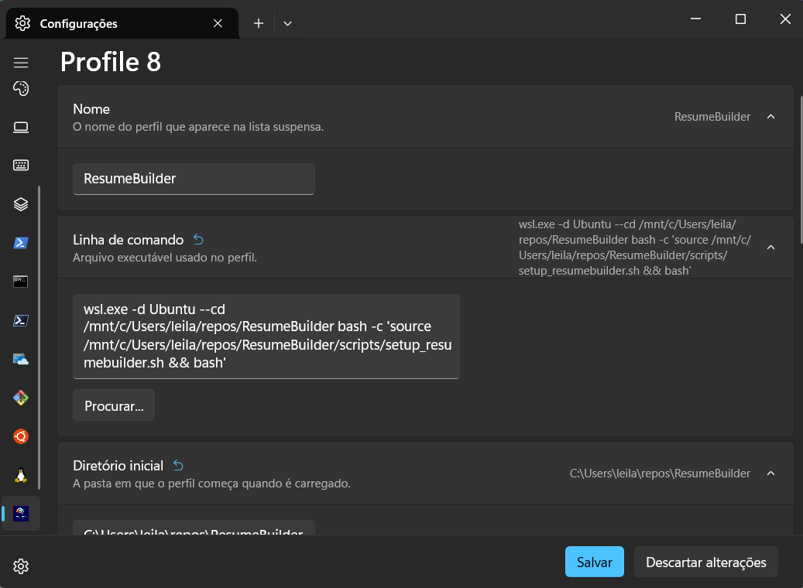
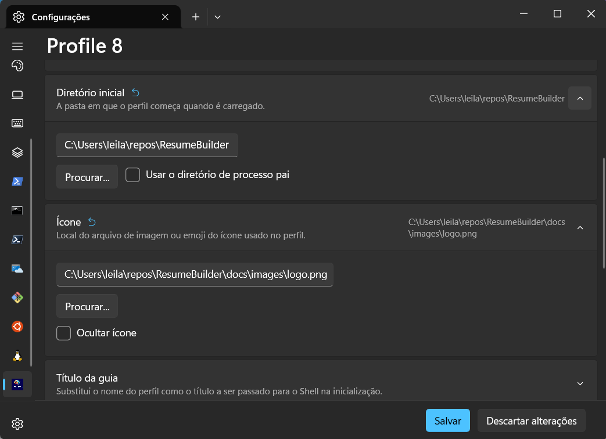

<!----------------------------------------------------------------------- 
	This is part of the documentation of Deployo.io Resume Builder System.
	Copyright (C) 2025
	Leila Otto Algarve
	Licensed under the GNU Free Documentation License v1.3 or later.
    See LICENSE-DOCUMENTATION for details. 
------------------------------------------------------------------------>
# Configurações

## Git

### Seus Dados
`git config --global user.name "<seu nome>"`  
`git config --global user.email "<seu email>"`

### Final de Linha
Se o Git alterar o estilo de final de linha, alguns scripts podem não funcionar corretamente.  
`git config --global core.eol lf`  
`git config --global core.autocrlf false`

## WSL

Você pode criar um novo perfil no Windows Terminal para o WSL que inicie no diretório raiz do projeto e configure o `PATH` junto com outras variáveis de ambiente.

**Passos:**
1. Abra as configurações: use o menu ou pressione `Ctrl+,`.
2. Clique no sinal de mais (`+`) para adicionar um novo perfil.
3. Defina um nome, por exemplo, `ResumeBuilder`.
4. Defina a linha de comando: `wsl.exe -d Ubuntu --cd <diretório_raiz_do_projeto>/ResumeBuilder bash -c 'source <diretório_raiz_do_projeto>/ResumeBuilder/scripts/setup_resumebuilder.sh && bash'`.
5. Defina o diretório inicial: `<diretório_raiz_do_projeto>`.
6. (Opcional) Ícone: selecione o logotipo em `<diretório_raiz_do_projeto>/docs/images/logo.png`.
7. (Opcional) Aparência: escolha um esquema de cores e uma fonte.

As duas figuras abaixo mostram minha configuração:

  

