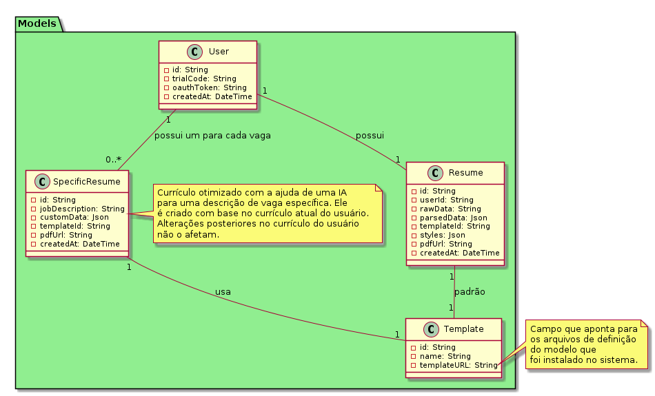

<!----------------------------------------------------------------------- 
	This is part of the documentation of Deployo.io Resume Builder System.
	Copyright (C) 2025
	Leila Otto Algarve
	Licensed under the GNU Free Documentation License v1.3 or later.
    See LICENSE-DOCUMENTATION for details. 
------------------------------------------------------------------------>
# Funcionamento do ResumeService no Resume Builder System

O **ResumeService** é o componente central do **Resume Builder System**, responsável por gerenciar o fluxo de criação, edição e geração de currículos, tanto na forma de um currículo base (`Resume`) quanto em versões personalizadas para vagas específicas (`SpecificResume`). Ele coordena interações entre diversas camadas da arquitetura, como modelos, serviços auxiliares, repositórios e utilitários, garantindo uma experiência fluida para o usuário. Abaixo, detalhamos como o serviço opera em seus principais casos de uso.

## Estrutura e Relacionamentos

O `ResumeService` trabalha com as seguintes entidades principais, definidas no pacote `Models`:

- **User**: Representa o usuário, que pode ser anônimo (com `trialCode`) ou autenticado via OAuth (`oauthToken`). Cada usuário possui um único currículo base (`Resume`) e pode ter múltiplos currículos específicos (`SpecificResume`).
- **Resume**: O currículo base do usuário, contendo dados brutos (`rawData`), dados parseados (`parsedData`), um template padrão (`templateId`), estilos personalizados (`styles`), uma URL de PDF gerado (`pdfUrl`) e metadados como `createdAt`.
- **SpecificResume**: Uma versão otimizada do currículo para uma vaga específica, criada com base no `Resume` do usuário no momento da geração. Inclui a descrição da vaga (`jobDescription`), dados personalizados (`customData`), um template associado (`templateId`) e a URL do PDF (`pdfUrl`). Alterações posteriores no `Resume` não afetam os `SpecificResume` já criados.
- **Template**: Define os modelos disponíveis, com um identificador (`id`), nome (`name`) e uma URL (`templateURL`) apontando para os arquivos de definição instalados no sistema.

Os relacionamentos são:

- Um `User` tem um `Resume` (1:1).
- Um `User` pode ter zero ou mais `SpecificResume` (1:N), um para cada vaga.
- Tanto `Resume` quanto `SpecificResume` usam um `Template` (1:1), sendo o do `Resume` o padrão.

## Fluxo de Operação

### 1. Criação do Currículo Base

Quando um usuário faz upload de um arquivo (PDF, Word ou texto) após se registrar:

1. O `ResumeController` recebe a requisição e delega ao `ResumeService`.
2. O `ResumeService` utiliza o `DocumentParser` para extrair os dados brutos (`rawData`) do arquivo.
3. Esses dados são enviados ao `AIService`, que utiliza uma IA externa (como a do Google) para analisar e gerar dados parseados (`parsedData`) estruturados.
4. O `ResumeService` salva o `Resume` no `ResumeRepository` com `rawData` e `parsedData`.
5. Os dados parseados são retornados ao usuário via `ResumeController` para revisão.
6. O usuário pode solicitar sugestões de melhorias ao `AIService`, que retorna recomendações baseadas na análise da IA, permitindo edições manuais antes de salvar as alterações.

### 2. Geração de Currículo Personalizado para uma Vaga

Quando o usuário deseja criar um currículo adaptado a uma vaga específica:

1. O usuário envia a descrição da vaga (`jobDescription`) via `ResumeController`.
2. O `ResumeService` recupera o último template usado ou o padrão do `Resume` através do `TemplateService`.
3. O `AIService` é chamado para personalizar os dados do `Resume` (`parsedData`) com base na `jobDescription`, gerando `customData` otimizado para a vaga.
4. O `customData` é exibido ao usuário, que pode editá-lo manualmente.
5. Após ajustes, o usuário solicita um preview, gerado pelo `LatexRenderer` com o template escolhido.
6. Quando satisfeito, o usuário solicita a geração do PDF:
   - O `ResumeService` coordena o `LatexRenderer` para criar o arquivo PDF a partir de `customData` e do template.
   - O PDF é enviado ao `FileStorage`, que o armazena temporariamente no `S3Storage` (com validade de 3 dias) e retorna uma `pdfUrl`.
   - O `SpecificResume` é salvo no `SpecificResumeRepository` com os dados personalizados e a `pdfUrl`.
7. A `pdfUrl` é retornada ao usuário para download.

## Integrações e Dependências

O `ResumeService` depende de:

- **AIService**: Fornece parsing avançado e sugestões de melhoria via IA externa, substituindo o antigo `GenisysService`.
- **TemplateService**: Gerencia os templates disponíveis, fornecendo o `templateURL` para renderização.
- **DocumentParser**: Extrai dados brutos de arquivos enviados.
- **LatexRenderer**: Converte dados e templates em PDFs.
- **FileStorage**: Abstrai o armazenamento no S3, garantindo URLs temporárias.
- **Repositories**: Persistem os dados de `Resume` e `SpecificResume`.

## Características Técnicas

- **Modularidade**: O `ResumeService` separa responsabilidades, delegando tarefas específicas a serviços auxiliares.
- **Escalabilidade**: Integração com AWS Lambda e S3 permite lidar com picos de uso sem custos fixos elevados.
- **Flexibilidade**: Suporta usuários anônimos e autenticados, com currículos base e personalizados independentes.

## Considerações Finais

O `ResumeService` é o coração do sistema, oferecendo um fluxo intuitivo para criar e personalizar currículos. A integração com IA via `AIService` eleva a qualidade do parsing e das sugestões, enquanto o uso de templates LaTeX garante PDFs profissionais. A arquitetura leve e serverless mantém o sistema econômico e escalável, ideal para cenários de baixa demanda inicial com potencial de crescimento.
